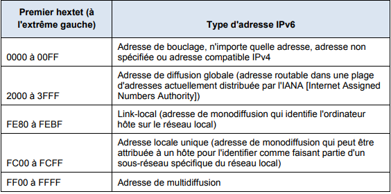

# Chapitre 7 : Adressage IP

## IPv4

Pour éfféctuer la conversion, il faut commencer par comprendre la notation pondérée

====>7.1<====

## IPv6

Une adresse IPv6 est longue de 128 Bits et est représentée comme une suite d'enesembles de 4 signes hexadécimaux appelés segments. Pour réduire cette adresse on peut : 

* **Omettre les 0 au debut des degments** ainsi chaque segment est réduit. Cette regle ne s'applique pas aux zéros de fin de segment, ainsi, il y a toujours au moins un signe sur un segments
* **On peut omettre** un seul fois dans une adresse **une séquence complète** de 0 par les `::` ainsi si 3 segments de 0 complets se suivent, on peut les remplacer par `::`.

Les adresses IPv6 permettent la mise en place d'un monodiffusion mais aussi d'une multidiffusion pouvant etre utilisée pour la diffusion. par l'utilisation de plusieurs types d'adresses

* **Monodiffusion globale** Une adresse IP unique au niveau mondial permettant de communiquer avec une autre machine quelque soit son réseau. Une adresse de diffusion globale, se compose d'un préfixe de routage global (48  its) attribué par le FAI, d'un identifiant de sous réseau (16 Bits) le positionnant dans les sous réseaux d'une entreprise par exemple et enfin un identifiant d'interface (64 bits) équivalent a la partie hote d'une adresse IPv4
* **Link-Local (FE80::/10)** Une adresse IP utilisable uniquement dans un réseau local et ne pouvant être utilisée hors de celui ci. Les adresses de ce réseau sont définies sur une plage `FE80::/10`
* **Bouclage (::1/128)** Une adresse IP permettant de contacter sa propre machine
* **local unique** Une plage d'adresse réservée pour le local permettant une communication dans un même réseau local

La configuration d'un routeur pour utiliser l'IPv6 est semblable à la procédure pour l'IPv4 ormis le remplacement du mot "ip" par "ipv6".

Pour donner une adresse IPv6 aux hotes du réseau, on utilise le protocole SLAAC mais on peut aussi utiliser le protocol DHCPv6. Le protocol SLAAC fonctionne sur un serveur et plus précisement le serveur centrale sur lequel se positionne l'hote. Ce serveur envoie des emissions sur le réseau local toutes les 200 secondes mais les informations du routeur venvent aussi etre demandés par un hote.

Ainsi, un hote peut obtenir une adresse IPv6 suivant 3 techniques :

* **SLAAC** La méthode sans intervation du DHCP où l'hote génère lui même son adresse IPv6 avec les informations reçus par le routeur soit le prefix du réseau, l'adresse de la passerelle, l'adresse du DNS et le nom de domaine.
* **SLAAC & DHCP** Dans ce mode les informations de création d'adresse sont fournies par le routeur ainsi que la passerelle mais le DNS est offert par le DHCP
* **DHCP** Dans ce mode, le routeur fournis l'adresse de passerelle et le DHCP fournis l'adresse a utiliser; l'hote ne doit donc pas genèrer son adresse IP

L'ID d'interface génèrée dans le mode 1 et 2 le sont suivant l'une des deux métodes suivantes :

* **Génération d'une suite bits aléatoire**
* **EUI-64** Dans ce système l'adresse MAC de la connexion est utilisé, séparé entre la parti constructeur et identifant puis on insère la valeur `FFFE` entre les deux puis on inverse le 7e bit de l'adresse MAC; 

On ajoute ensuite le prefix donné par le routeur au debut puis l'adresse IPv6 peut etre utilisée.

Sur un routeur cisco on peut configurer une adresse Link-Local manuellement avec la commande `ipv6 address <adresse> link-local` puis vérifier ces adresses avec la commande `show ipv6 interface brief`

### Multidiffusion

Il existe deux types de multidiffusion permettant de distribuer des paquets a un ensemble d'hotes.

* **Multidiffusion a adresses attribués** On donne une adresse de multidiffusion a un groupe d'hotes. Ces adresses ont le prefix `FF00::/8`. Il en existe deux principaux. `FF02::1` permet d'envoyer un message a tout les hotes du réseau et `FF02::2` permet d'envoyer a tout les routeurs du réseau
* **Mutidiffusion a noeuds sollicités** couplé a l'adresse ethernet de diffusion, cette technique permet d'envoyer a tout les hotes munis d'une adresse IPv6 et ce sont ces hotes qui décident de la prendre en compte ou non

### Types adresses IPv6 

## ICMP

les paquets ICMP sont des paquets permettant d'informer et de gèrer les érreurs sur le réseau. Il en exite beaucoup et nous en etudierons ici 4.

Le paquet **Host confirmation** permet de demander une confirmation de présence a l'hote. On envie alors un paquet `echo` a un hote qui répond par un autre paquet `echo`.

Le paquet **Destination  or service unreachable** est utilisé pour avertire que le paquet n'a pus atteindre la cible due a un certaine raison qui est decris suivant un code :

* **0** Réseau inaccessible
* **1** Hote inaccessible
* **2** Protocol inacessible
* **3** Port anacessible

Le paquet de **dépassement du delai** est envoyé si le champ TTL ou nombre de tronçons est dépassé et donc le paquet ne peut etre transmis.

La **solicitation et annonce de routeur** et un paquet unqiuement disponible en ICMPv6 permettant a un hote de repèrer les routeurs sur le réseau et aux routeurs d'annoncer leur position.

La **solicitation et annonce de voisin** est un système comparable au protocol ARP de IPv4. C'est par ce système que le périphérique générant son adresse IPv6 peut vérifier de l'unicité de celle ci, en envoyant une requète de demande de voisin sur sa propre adresse fraichement génèrée.
